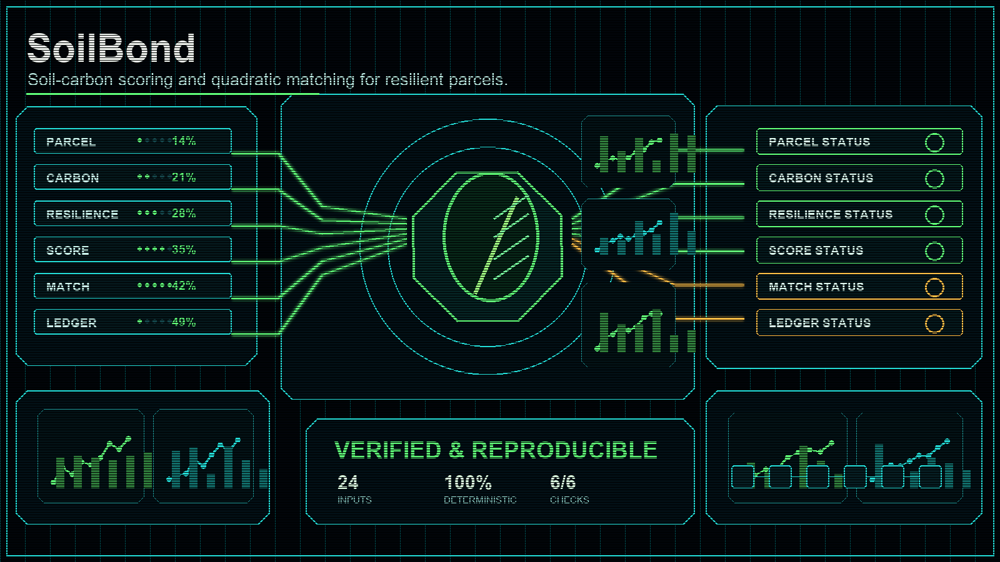

# SoilBond

> Score soil-carbon reduction parcels by carbon density and climate resilience, then allocate a quadratic-funding matching pool.

## One-sentence pitch

`SoilBond` answers: *How should a climate fund distribute incentives across farmland parcels so that both verified carbon reduction and ecosystem resilience are rewarded, with quadratic funding that amplifies broad participation?*

It is a recombination of three primitives — **FieldRoot** (precision agriculture), **ClimateMesh** (climate resilience), and **QuadraticCarbonFund** (quadratic funding) — into a single stdlib-only engine.

## Install / Run

Requires Python 3.10+ and no external packages.

From this project root:

```bash
python -m pip install -e .
python -m SoilBond sample --out examples
python -m SoilBond score --parcel-id P-001 --carbon 150 --resilience 0.85 --area 20
python -m SoilBond allocate --input examples/allocation.json
python -m SoilBond report --input examples/allocation.json --out examples/report.md
```

After installing into the environment:

```bash
pip install -e .
soil-bond sample --out examples
soil-bond score --input examples/p-alpha.json
soil-bond allocate --input examples/allocation.json
soil-bond report --input examples/allocation.json
```

## CLI

| Subcommand | Purpose |
|---|---|
| `sample` | Write deterministic sample parcel fixtures (individual parcels + `allocation.json`). |
| `score` | Score a single parcel. Accepts `--input` (parcel JSON) or individual flags (`--parcel-id`, `--carbon`, `--resilience`, `--area`). |
| `allocate` | Score parcels and allocate a quadratic-funding pool from an allocation-config JSON. |
| `report` | Render a Markdown report from an allocation result JSON. |

### Allocation config format

```json
{
  "pool_size": 100000.0,
  "per_parcel_cap": 35000.0,
  "parcels": [
    {"parcel_id": "P-ALPHA", "carbon_reduction_tco2": 150.0, "resilience_score": 0.85, "area_hectares": 20.0}
  ]
}
```

`per_parcel_cap` is optional. When omitted the full pool is distributed by quadratic proportion. When set, parcels whose share would exceed the cap are locked at the cap and the surplus is redistributed to uncapped parcels (water-filling).

## Scoring

For each parcel:

- `carbon_density = carbon_reduction_tco2 / area_hectares`
- `combined_score = sqrt(carbon_reduction_tco2) * resilience_score`

The `combined_score` is the quadratic-funding input.

## Quadratic funding

Each parcel's raw match:

```
raw_match = pool_size * score_i^2 / sum(score_j^2)
```

With a per-parcel cap, excess from capped parcels is redistributed proportionally to the remaining uncapped parcels until no uncapped parcel breaches the cap. `total_allocated` equals `pool_size` whenever the cap is not so low that every parcel is capped.

## Python API

```python
from SoilBond import score_parcel, allocate_matching_pool, render_report

parcel = score_parcel("P-001", carbon_reduction_tco2=150.0, resilience_score=0.85, area_hectares=20.0)
print(parcel["combined_score"])

parcels = [
    score_parcel("P-001", 150.0, 0.85, 20.0),
    score_parcel("P-002", 80.0, 0.92, 12.0),
]
result = allocate_matching_pool(parcels, pool_size=100000.0, per_parcel_cap=35000.0)
print(result["total_allocated"])

print(render_report(result))
```

## Tests

From this project root:

```bash
python -m unittest discover -s tests -q
```

## License

MIT License — see [LICENSE](LICENSE).
